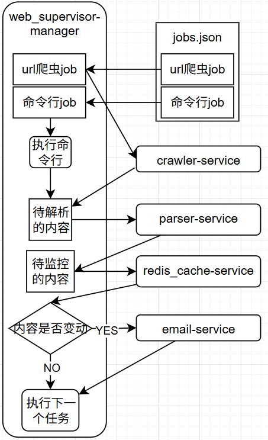
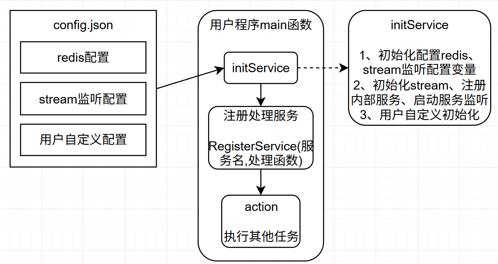
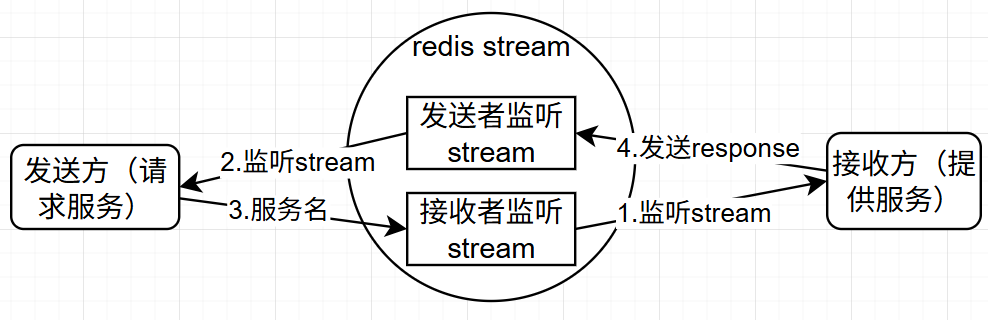

# WebSupervisor-microservice-v2

基于 **Redis Streams** 的 Go 微服务框架与示例集合。所有服务之间不直接通信，而是通过 Redis Stream 传递消息实现"请求-响应"式 RPC；`MyTool/stream` 库封装了全部通信细节，让一个微服务只需要"写 handler + 注册"即可运行。

## 目录结构

```
WebSupervisor-microservice-v2/
├── MyTool/                        # 公共工具库（module: github.com/totooicu/go-mytool）
│   ├── stream/                    # ★ 微服务通信库（本文档主角）
│   ├── streamtool/                # 早期版本通信工具包（已由 stream/ 取代，保留参考）
│   ├── streams-manager/           # Redis Stream 命令行管理/调试工具（见其 README）
│   ├── http/                      # HTTP 客户端与 HTML/XPath/JSON 解析器
│   ├── redis/ config/ email/ file/ json/ string/ array/ set/ sync/ encryption/ response/
├── microservice/                  # 示例微服务
│   ├── calculator-service/        # 计算服务（最小示例）
│   ├── crawler-service/           # HTTP 抓取服务
│   ├── parser-service/            # HTML/XPath/JSON 解析服务
│   ├── redis_cache-service/       # 缓存与变更比较服务
│   ├── email-service/             # SMTP 邮件服务
│   ├── web_supervisor-manager/    # 网页监控编排器（jobs.json 驱动）
│   ├── microservice-manager/      # 调用各服务的示例客户端
│   ├── build_web_supervisor.bat   # 一键交叉编译 5 个服务
│   └── run_web_supervisor.bat     # 一键启动 5 个服务
├── go.work                        # Go workspace，聚合所有 module
└── go.mod
```

## 整体架构


web_supervisor-microservice流程结构



stream初始化过程



stream消息发送接收过程


一次调用的完整链路：

1. 客户端 `stream.Send(targetStream, serviceName, payload, timeoutMs)`：生成 `message_id`，把 `StreamMessage` 写入目标服务的 Stream，然后阻塞等待响应。
2. 目标服务的 `consumeLoop` 从自己的 Stream（`consumer_stream`）以消费者组（`consumer_group`）读取消息，按 `service_name` 分发到 `RegisterService` 注册的 handler。
3. handler 处理完调用 `stream.ResponseSucc / ResponseErr`，响应消息写回请求方的 `callback_stream`，`service_name` 固定为 `"response"`，`reply_id` 为请求的 `message_id`。
4. 客户端收到响应后从等待队列中取出并返回；消息处理完立即 `XAck + XDel`。

### 关键机制

| 机制 | 说明 |
|---|---|
| 请求-响应 RPC | 每条请求带唯一 `message_id` 和 `callback_stream`，响应通过 `reply_id` 关联 |
| 大消息自动分片 | 消息超过 `max_message_bytes` 自动按字节分片发送，接收端（`ShardManager`）重组，请求与响应均支持 |
| Deadline 超时丢弃 | 消息携带绝对时间戳（毫秒），消费端发现已过期直接 `Ack+Del` 丢弃，避免处理过期任务 |
| 并发控制 | `goroutine_num` 作为信号量限制同时执行的 handler 数量；`ping` 不占信号量 |
| 至少一次消费 | 消费者组 + 处理完 `XAck`/`XDel`；进程崩溃未确认的消息会留在 PEL 中 |
| 环境变量注入 | 配置文件中任意字符串支持 `${ENV_NAME}` 展开（如 `${QQ_MAIL_PASSWORD_1134}`） |
| 内置服务 | 每个服务自动注册 `ping`（返回协程状态）与 `response`（内部响应分发），可用于健康检查 |

## 如何用 stream 库构建一个微服务

stream 库位于 `MyTool/stream`（module `github.com/totooicu/go-mytool/stream`）。新建一个微服务只需三步：

### 第 1 步：建立 module 并引入库

在 `go.work` 中 `use` 你的新目录，然后在该目录 `go mod init` 并 `go mod tidy`（依赖 `github.com/totooicu/go-mytool`）。

### 第 2 步：编写 config.json

```json
{
  "redis": {
    "addr": "localhost:6379",
    "password": "",
    "db": 0
  },
  "stream": {
    "consumer_stream": "dev:my-stream",
    "consumer_group": "my-group",
    "goroutine_num": 5,
    "get_timeout_ms": 5000,
    "max_message_bytes": 204800,
    "cache_key_prefix": "my:"
  },
  "custom": {
    "any_business_field": "自由配置，代码里用 stream.Custom[\"any_business_field\"] 读取"
  }
}
```

#### 通用字段解释

**`redis`（通信使用的 Redis 实例）**

| 字段 | 说明 |
|---|---|
| `addr` | Redis 地址，如 `localhost:6379` |
| `password` | 密码，无密码留空 |
| `db` | 逻辑库编号 |

**`stream`（通信行为）**

| 字段 | 说明 |
|---|---|
| `consumer_stream` | 本服务监听的 Stream 名称，即服务身份。其它服务向该名称的 Stream 发消息即可调用本服务 |
| `consumer_group` | Redis 消费者组名称，同一 Stream 可有多个组各自独立消费 |
| `goroutine_num` | 业务 handler 的最大并发数（信号量） |
| `get_timeout_ms` | `stream.Send` 未显式指定超时时的默认等待时间（毫秒） |
| `max_message_bytes` | 单条消息最大字节数，超过自动分片；缺省 1MB（1048576） |
| `cache_key_prefix` | `stream.CacheSet/CacheGet/CacheDelete` 辅助缓存的 key 前缀，缺省 `stream:` |

**`custom`**：自由业务配置块（`map[string]interface{}`），库不做解析，由服务自己通过 `stream.Custom["字段名"]` 读取。各示例服务用它存放下游服务 Stream 名称、SMTP 账号、任务文件路径等。值中同样支持 `${ENV}` 展开。

### 第 3 步：编写 main.go（模板）

```go
package main

import (
	"log"
	"os"
	"os/signal"
	"syscall"

	"github.com/totooicu/go-mytool/stream"
)

func initService() {
	// LoadConfig 默认读 "config.json"，也可用命令行第一个参数覆盖：my-service -config other.json
	if err := stream.LoadConfig("config.json"); err != nil {
		log.Fatal("load config error:", err)
	}
	if err := stream.Init(); err != nil { // 连接 Redis、建消费者组、启动消费循环
		log.Fatal("stream init error:", err)
	}
}

func main() {
	initService()

	// 注册服务：服务名 -> 处理函数
	stream.RegisterService("hello", handleHello)

	log.Println("My service started")
	quit := make(chan os.Signal, 1)
	signal.Notify(quit, syscall.SIGINT, syscall.SIGTERM)
	<-quit
}

// handler 签名固定：func(*stream.StreamMessage)
func handleHello(msg *stream.StreamMessage) {
	// 1. msg.Playload 是 map[string]interface{}（请求参数）
	name, _ := msg.Playload["name"].(string)
	if name == "" {
		stream.ResponseErr(msg, "name is required") // 失败响应：err_code=1
		return
	}
	// 2. 处理业务...
	// 3. 成功响应：playload 会作为调用方的返回值
	stream.ResponseSucc(msg, map[string]interface{}{"greeting": "hello " + name})
}
```

### 客户端调用

```go
// Send(目标Stream, 服务名, playload, 超时毫秒)
// 超时: 0=使用 get_timeout_ms；-1 设计为不限时(当前实现有立即超时问题，建议传足够大的正数)
resp, err := stream.Send("dev:my-stream", "hello",
	map[string]interface{}{"name": "world"}, 5000)
if err != nil {
	log.Println("failed:", err) // 超时或对端 ResponseErr
}
log.Println(resp.Playload["greeting"])

// 健康检查
stat, err := stream.SendPing("dev:my-stream")
log.Println(stat.Playload) // {"active_handlers":0,"capacity":5,"available":5,"total_goroutines":N}
```

### StreamMessage 消息结构

| 字段 | 说明 |
|---|---|
| `message_id` | 全局唯一消息 ID（时间戳 + Redis 自增） |
| `reply_id` | 响应消息中关联的请求 ID |
| `service_name` | 目标服务名；响应固定为 `response` |
| `callback_stream` | 响应回发的 Stream |
| `source_stream` / `source_service` | 请求来源 |
| `playload` | 业务数据，`map[string]interface{}`，以 JSON 字符串形式在 Stream 中传输（字段拼写即 `playload`） |
| `sharding_id` / `sharding_total` / `sharding_data` | 分片信息与分片数据 |
| `err_code` / `err_msg` | 0 成功；非 0 失败（`ResponseErr` 使用 1） |
| `deadline` | 绝对过期时间戳（毫秒），0 表示不限 |
| `trace_id` | 链路追踪 ID，透传 |

### 其它库函数

| 函数 | 说明 |
|---|---|
| `stream.CacheSet(key, value, ttlMs)` | 内容寻址简易缓存：实际存储 key = `前缀:key:MD5(value)` |
| `stream.CacheGet / CacheDelete` | 读取/删除上述缓存 |
| `stream.GetMyRedisClient()` | 获取封装后的 Redis 客户端（通信 Redis） |
| `stream.AckAndDelete(...)` | 确认并删除消息（消费循环内部使用） |

## 示例微服务一览

| 服务 | 监听 Stream（默认） | 提供的服务 | 用途 |
|---|---|---|---|
| [calculator-service](microservice/calculator-service/README.md) | `dev:calculator-stream` | `add`、`divide` | 最小示例：数组求和、除法 |
| [crawler-service](microservice/crawler-service/README.md) | `dev:crawler-stream` | `http_request` | 发送 HTTP 请求，返回页面内容与状态码 |
| [parser-service](microservice/parser-service/README.md) | `dev:parser-stream` | `parse_html_by_get_mid`、`parse_html_by_xpath`、`parse_json` | 从 HTML/JSON 文本中提取数据 |
| [redis_cache-service](microservice/redis_cache-service/README.md) | `dev:redis_cache-stream` | `compare_and_save`、`get`、`set`、`delete`、`get_and_set` | 缓存读写与新旧数据比较（变更检测） |
| [email-service](microservice/email-service/README.md) | `dev:email-stream` | `email_by_config`、`email_by_custom` | SMTP 发送邮件（支持 QQ 邮箱 465/587） |
| [web_supervisor-manager](microservice/web_supervisor-manager/README.md) | `dev:web_supervisor-stream` | （编排器，无对外业务服务） | 定时执行 jobs.json 中的网页监控任务：抓取→解析→变更检测→邮件通知 |
| [microservice-manager](microservice/microservice-manager/README.md) | `dev:client-stream` | （客户端示例） | 演示调用上述所有服务的方式 |

各服务 README 中包含：服务接口清单、请求/响应 playload 格式、`config.json` 中 `custom` 字段含义与调用示例。

各服务的详细数据流（以监控任务为例）：

```
web_supervisor-manager
   │ 1 http_request                2 parse_html_by_get_mid / parse_json
   ├──────────► crawler-service    ├──────────► parser-service
   │            返回 content,status │            返回 parsed_data
   │ 3 compare_and_save / set      4 有变化时 email_by_config
   ├──────────► redis_cache-service├──────────► email-service
   │            返回 changed        │            发送通知邮件
```

## 构建与运行

前提：本机或远程运行 Redis；Go 1.25+（使用 `go.work`，无需手动替换依赖）。

```bat
cd microservice

:: 一键交叉编译 5 个服务（crawler/email/parser/redis_cache/web_supervisor）到 bin\ 目录
build_web_supervisor.bat

:: 一键启动 5 个服务（各开一个 cmd 窗口）
run_web_supervisor.bat
```

手动编译/运行单个服务（在服务目录内）：

```bash
go build -o my-service.exe .
./my-service.exe            # 使用默认 config.json
./my-service.exe -config my.json   # 用命令行参数指定配置文件
```

配置文件中密码、邮箱账号等敏感信息建议用环境变量注入，例如 config.json 写 `"password": "${QQ_MAIL_PASSWORD_1134}"`，启动前 `set QQ_MAIL_PASSWORD_1134=xxx`。

## 调试工具

- `MyTool/streams-manager`：Redis Stream 命令行管理工具，可查看/添加/删除 Stream 与消息（详见其目录内 README），排障时可用 `streams-manager ls dev:crawler-stream` 直接查看队列内容。
